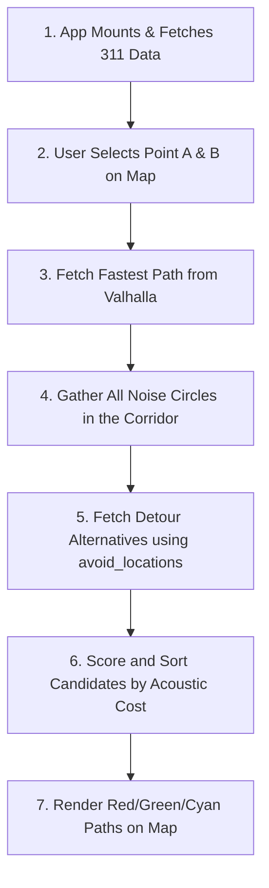

# LLLoud - NYC Acoustic Pedestrian Navigator

LLLoud is a real-time, walkable pedestrian navigation and noise pollution mapping application designed for New York City. Unlike traditional map routers that prioritize speed above all else, LLLoud utilizes live acoustic data, NYC 311 Open Data noise complaints, and crowd-sourced community reports to calculate routes optimized for quietness, mental well-being, and acoustic sanctuary.

---

## 🌟 Key Features

*   **100% Real Walkable Routes**: Powered by the **Valhalla Routing Engine** using live OpenStreetMap (OSM) sidewalk, crosswalk, and park path geometries.
*   **Three Acoustic Routing Profiles**:
    *   **Fastest Commute (Rose)**: The most direct street-level walking path. Exposes the user to typical avenue traffic and noise (75–88+ dB).
    *   **Quietest Route (Emerald)**: Intelligently detours around noise hotspots intersecting the primary path. Provides a balance of speed and peace.
    *   **Noise-Free Route (Cyan)**: Aggressively re-routes around *every* noise zone, 311 cluster, and logged hazard inside the commute corridor, utilizing custom parallel-grid detours.
*   **Live NYC 311 Open Data Integration**: Dynamically queries the official **NYC OpenData (Socrata API)** on mount, importing live noise complaints (Commercial, Construction, Sidewalk, Vehicle) and transforming them into active avoidance zones.
*   **Crowdsourced Community Reports**: Features a decentralized local network via browser-level `BroadcastChannel` APIs, synchronizing live noise/quiet updates across active tabs and users immediately.
*   **Real Audio Analysis & Personal Logging**: Real-time microphone capture (decibels SPL) featuring adjustable frequency-weighting, calibration offsets, and history logging. Personal loud spots feed back into your routing engine automatically.
*   **Responsive SoundMap**: High-performance Leaflet mapping featuring sound density heat overlays, interactive A/B click placement, and automatic zoom bounds fitting.

---

## 🛠️ Tech Stack

*   **Frontend**: React 18, TypeScript, Vite
*   **Styling**: Modern CSS, Tailwind CSS
*   **Mapping**: Leaflet, React Leaflet (using custom divIcons and reactive layer groups)
*   **Routing Engine**: Valhalla (`valhalla1.openstreetmap.de`) with custom detour waypoint calculations
*   **APIs**: NYC Open Data Socrata API, OSM Photon Geocoder
*   **Icons**: Lucide React

---

## 🏛️ NYC Open Data (311 Noise) Integration

LLLoud connects directly to the official **NYC Open Data Portal** using the Socrata Open Data API (SODA) to retrieve live, active noise complaints across all five boroughs.

### API Endpoint & Query
Upon application mount, the client performs an asynchronous HTTP fetch to the following endpoint:
```
https://data.cityofnewyork.us/resource/erm2-nwe9.json
```
We construct a SODA SQL query (`$where`, `$order`, and `$limit`) to request real-time noise reports:
```sql
starts_with(complaint_type, 'Noise') AND latitude IS NOT NULL
ORDER BY created_date DESC
LIMIT 120
```

### Data Schema Mapping
We parse the returning JSON list of **311 Service Requests** and map them to our internal `CommunityNoiseReport` structure:

1.  **Unique Tracking ID**: Extracted from Socrata's `unique_key` (prefixed as `nyc311-${unique_key}`) to ensure route-key stability and avoid duplicate markers.
2.  **Coordinates**: Parsed from the string fields `latitude` and `longitude` to define the absolute geographic center of the noise zone on Leaflet.
3.  **Source Attribution**: Uses the `agency` field (e.g., `NYPD`, `DEP`, `DOB`) to show users who is investigating, and links to the official permalink for that record via `serviceRequestId`.
4.  **Acoustic Decibel Conversion**: Because 311 reports do not contain raw decibel levels, we analyze the `descriptor` and `complaint_type` text fields to estimate the noise impact:
    *   **Jackhammering / Heavy Machinery / Construction**: Categorized as `construction` with an estimated peak of **$88\text{ dB} - 95\text{ dB}$** (140m radius).
    *   **Loud Music / Party / Club / Commercial**: Categorized as `nightlife` with an estimated peak of **$80\text{ dB} - 88\text{ dB}$** (140m radius).
    *   **Horns / Engine Idling / Vehicle Noise**: Categorized as `horn-exhaust` with an estimated peak of **$82\text{ dB} - 90\text{ dB}$** (120m radius).
    *   **Other Street/Sidewalk Noise**: Defaults to **$76\text{ dB}$** (140m radius).

---

## 🗺️ How the Routing Engine Works (Step-by-Step)

The application coordinates the pedestrian router (`src/utils/pedestrianRouter.ts`) with Leaflet to compute and render paths through a 6-stage lifecycle:



### 1. Boot & Data Sync
The client queries the Socrata portal to fetch active 311 noise complaints. These are combined with crowd-sourced local reports and stored in React state. The coordinate-based hashes of these points are compiled into a stable React key (`routeKey`).

### 2. Base Pedestrian Route
When the user defines Point A (Start) and Point B (Destination), a primary walkable path is requested from Valhalla. Valhalla returns the shortest street-level path respecting crosswalks, sidewalks, and pedestrian lanes.

### 3. Corridor Hazard Scan
The router extracts the bounding coordinates of the Fastest path. It scans for any noise hazards (static zones, user mic logs, or live 311 reports) that fall within this bounding corridor.

### 4. Graph Avoidance Queries
To prevent the route from cutting back into noisy avenues too early, the coordinates and radiuses of the detected noise circles are passed directly to Valhalla's native `avoid_locations` payload.
*   **Quietest Route**: Passes active hazards directly intersecting the fastest path (150m buffer).
*   **Noise-Free Route**: Passes *all* nearby hazards within the corridor bounding box (300m buffer) plus any local user-logged microphone hotspots.
*   **Park Attraction**: The engine also queries routes passing through any nearby registered `quiet-haven` zones (like Bryant Park or Chelsea Park) to pull the path into acoustic sanctuaries.

### 5. Acoustic Cost Penalty Sorting
The engine scores every returned candidate route using our custom acoustic cost equation:
$$\text{Cost} = \sum (\text{Segment Distance} \times \text{Noise Factor})$$
$$\text{Noise Factor} = 1.0 + \text{Scale} \times \left(\frac{\text{decibels} - 45}{10}\right)^{\text{Exponent}}$$

*   **Quietest**: Uses a softer curve (`Scale = 5.0`, `Exponent = 2.3`) to balance minor detours with walking speed.
*   **Noise-Free**: Uses a steep, aggressive curve (`Scale = 12.0`, `Exponent = 3.8`) where even moderate avenue traffic noise is heavily penalized, forcing Valhalla to favor quiet side-streets and park pathways.

### 6. Map Rendering & HUD Selection
The three distinct paths are returned to the Leaflet map wrapper:
*   The unselected routes are rendered as thin dashed lines (Rose/Green/Cyan).
*   The active selected route (selected via the card HUD) is rendered as a thick, prominent solid line with glowing borders.

---

## 🚀 Getting Started

### Prerequisites

*   **Node.js**: v18 or later (v24.13.0 recommended)
*   **npm**: v9 or later

### Installation

1. Clone the repository and navigate to the project directory:
   ```bash
   git clone https://github.com/Yonzzy21/LLLoud.git
   cd LLLoud
   ```

2. Install dependencies:
   ```bash
   npm install
   ```

3. Run the local development server:
   ```bash
   npm run dev
   ```

4. Open your browser and navigate to `http://localhost:5173`.
