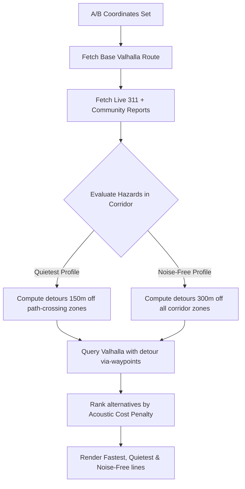

# LLLoud - NYC Acoustic Pedestrian Navigator

LLLoud is a real-time, walkable pedestrian navigation and noise pollution mapping application designed for New York City. Unlike traditional map routers that prioritize speed above all else, LLLoud utilizes live acoustic data, NYC 311 Open Data noise complaints, and crowd-sourced community reports to calculate routes optimized for quietness, mental well-being, and acoustic sanctuary.

---

## 🌟 Key Features

*   **100% Real Walkable Routes**: Powered by the **Valhalla Routing Engine** using live OpenStreetMap (OSM) sidewalk, crosswalk, and park path geometries.
*   **Three Acoustic Routing Profiles**:
    *   **Fastest Commute (Rose)**: The most direct street-level walking path. Exposes the user to typical avenue traffic and noise (75–88+ dB).
    *   **Quietest Route (Emerald)**: Intelligently detours around noise hotspots intersecting the primary path. Provides a balance of speed and peace.
    *   **Noise-Free Route (Cyan)**: Aggressively re-routes around *every* noise zone, 311 cluster, and logged hazard inside the commute corridor, utilizing custom parallel-grid detours.
*   **Live NYC 311 Open Data Integration**: Dynamically queries the official **NYC OpenData (Socrata API)** on mount, importing live noise complaints (Commercial, Construction, Sidewalk, Vehicle) and transforming them into active avoidance zones.
*   **Crowdsourced Community Reports**: Features a decentralized local network via browser-level `BroadcastChannel` APIs, synchronizing live noise/quiet updates across active tabs and users immediately.
*   **Real Audio Analysis & Personal Logging**: Real-time microphone capture (decibels SPL) featuring adjustable frequency-weighting, calibration offsets, and history logging. Personal loud spots feed back into your routing engine automatically.
*   **Responsive SoundMap**: High-performance Leaflet mapping featuring sound density heat overlays, interactive A/B click placement, and automatic zoom bounds fitting.

---

## 🛠️ Tech Stack

*   **Frontend**: React 18, TypeScript, Vite
*   **Styling**: Modern CSS, Tailwind CSS
*   **Mapping**: Leaflet, React Leaflet (using custom divIcons and reactive layer groups)
*   **Routing Engine**: Valhalla (`valhalla1.openstreetmap.de`) with custom detour waypoint calculations
*   **APIs**: NYC Open Data Socrata API, OSM Photon Geocoder
*   **Icons**: Lucide React

---

## 🚀 Getting Started

### Prerequisites

*   **Node.js**: v18 or later (v24.13.0 recommended)
*   **npm**: v9 or later

### Installation

1. Clone the repository and navigate to the project directory:
   ```bash
   git clone https://github.com/Yonzzy21/LLLoud.git
   cd LLLoud
   ```

2. Install dependencies:
   ```bash
   npm install
   ```

3. Run the local development server:
   ```bash
   npm run dev
   ```

4. Open your browser and navigate to `http://localhost:5173`.

---

## 🌐 Valhalla API Proxy Configuration

To prevent browser-level CORS restrictions and network latency anomalies, LLLoud contains a pre-configured Vite proxy. API calls made to `/api/valhalla1` and `/api/valhalla2` are automatically tunneled to the corresponding OSM Valhalla endpoints.

If you are deploying this to production, ensure your hosting provider's rewrite rules route `/api/valhalla1` to `https://valhalla1.openstreetmap.de` or configure a dedicated backend proxy.

---

## 🗺️ How the Routing Engine Avoids Noise

The pedestrian router (`src/utils/pedestrianRouter.ts`) processes route calculation in multiple steps:



### Acoustic Cost Penalty Equation
For each segment of a candidate route, we evaluate:
$$\text{Cost} = \text{Segment Distance} \times \left(1.0 + \text{Scale} \times \left(\frac{\text{decibels} - 45}{10}\right)^{\text{Exponent}}\right)$$

*   For the **Noise-Free Route**, the `Scale` is increased to **12.0** and the `Exponent` to **3.8**. This creates an aggressive penalty curve that strongly shifts routes towards quiet corridors (parks, pedestrianized zones, and quiet residential cross-streets) even if they require a longer walking distance.
